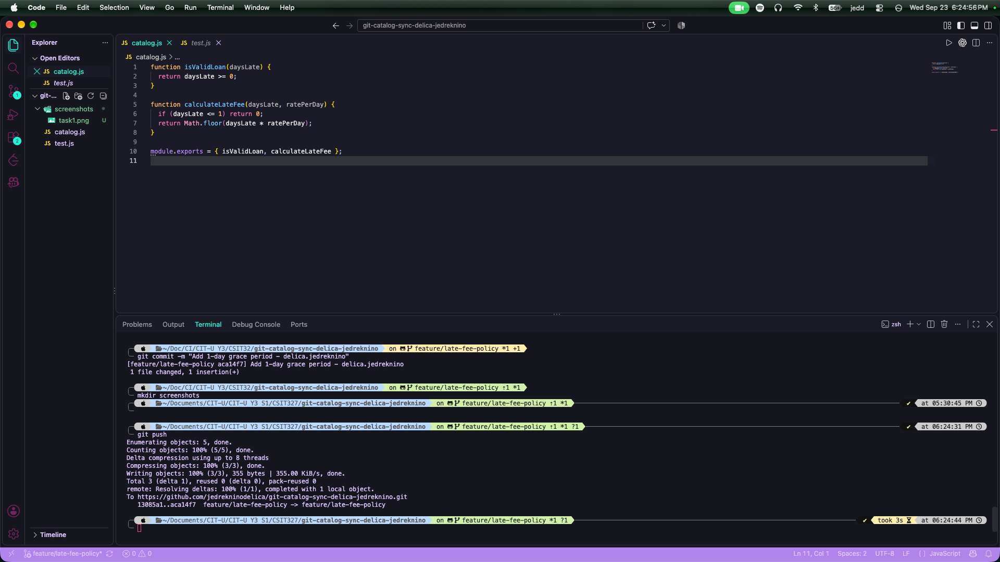
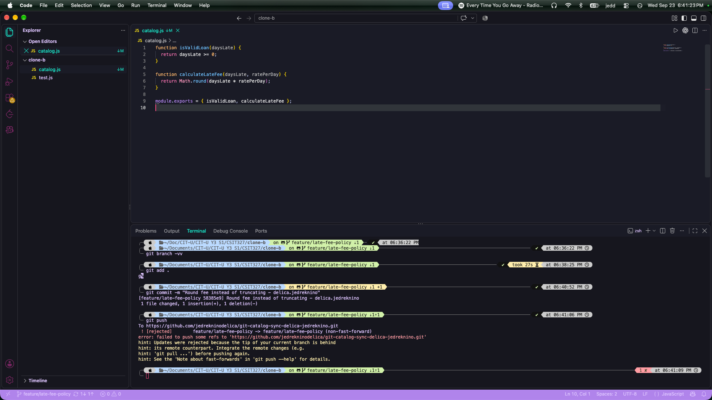
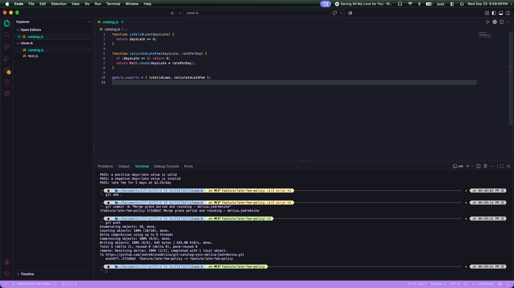
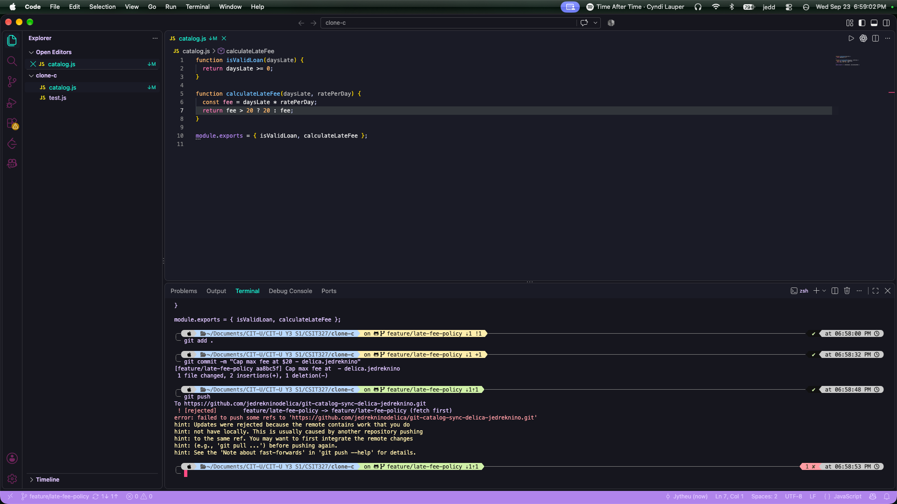
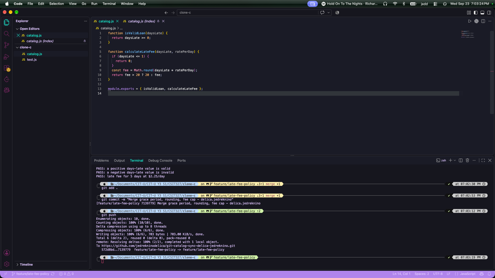
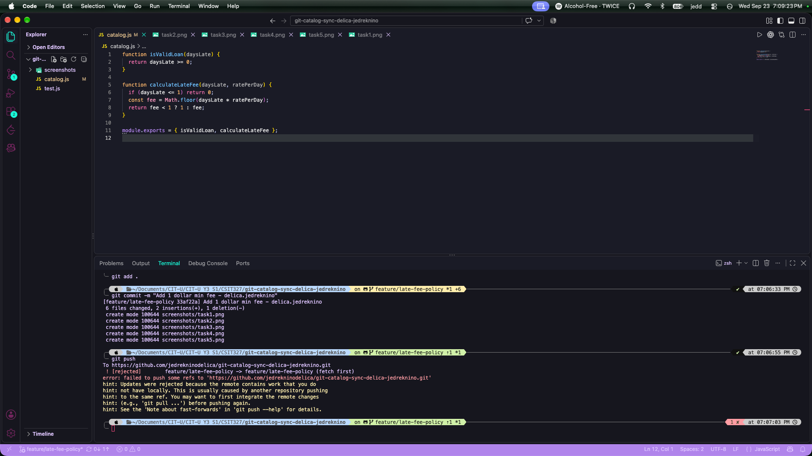
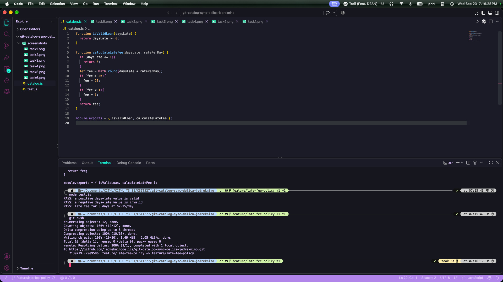
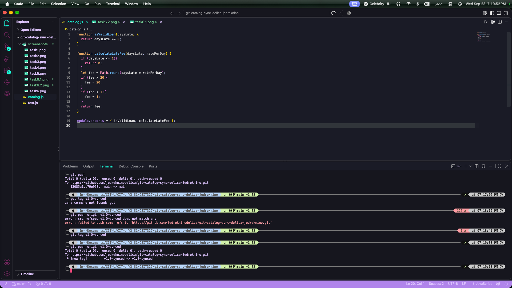

# WORKFLOW.md

## Task 1 - Push a change from Clone A
Added a 1-day grace period to the late fee calculation. Committed and pushed.

## Task 2 - Diverge from Clone B (rejected)
Changed fee to round instead of truncate. Tried to push but got rejected since clone B didn't have clone A's commit yet.

## Task 3 - Reconcile with a merge
Fetched and merged. Had to manually combine the grace period and rounding logic since Git couldn't do it automatically. Tests passed, pushed.

## Task 4 - Bring in the third contributor (rejected)
Added a $20 max fee cap in clone C. Push got rejected since the branch had moved twice already.

## Task 5 - Reconcile a three-way merge
Fetched and merged again, this time combining all three changes (grace period, rounding, cap) into one function. Tests passed, pushed.

## Task 6 - Diverge a third time, reconcile with a rebase
Added a $1 minimum fee in clone A without fetching first. Push got rejected.

Used fetch+rebase instead of merge this time. Resolved the conflict so all four rules (grace period, rounding, cap, minimum) worked together. I pushed without needing to force.

## Task 7 - Merge into main, tag
Merged the feature branch into main and pushed. Tagged it v1.0-synced and pushed the tag.

# Questions

1. Walk through the final calculateLateFee function and name which contributor's change is responsible for each part.
First, the grace period check was done by task 1 clone A. Second, round instead of floor was done in task 2-3 in clone b. Third, the cap was done in task 4-5 in clone C. Lastly, the minimum was done in task 6 in clone A.

2. Compare Task 3's two-way conflict to Task 5's three-way conflict - what got harder with a third line of work?
The three-way conflict in task 5 was obviously much more challenging for me because the function already had two behaviors already merged unto it and I had to fit a third one without breaking the first two.

3. What's the actual difference between how you resolved Task 5 (merge) and Task 6 (rebase)?
In task 5, I used a merge which kept both histories intact by creating a new merge commit that has two parent commits. In task 6, I used a rebase instead which rewrote my local commit so it sits on top of the latest history from origin. There is no merge commit with rebase and the history stays linear but it means my original commit got replaced with a new one during the process.

4. If this were a real team of three, what one process change would have prevented all three rejected pushes?
The rejections happened because someone started working from a local branch that was already outdated. If everyone ran git fetch and pulled latest changes right before starting any new work, conflicts would have been resolved early on.